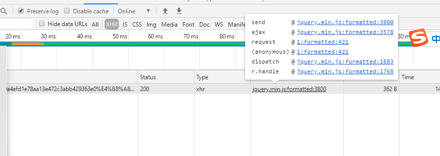
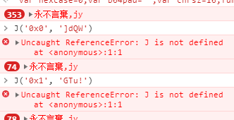

# 一.分析
http://match.yuanrenxue.com/api/match/1?page=3&m=49a4efd1e78aa13e472c3abb429363e0%E4%B8%A81620029973


m: 49a4efd1e78aa13e472c3abb429363e0丨1620029973
后面跟的这个参数可以获取到响应，那么找到这个参数的生成位置，即可破除加密

# 二.寻找参数时生成位置


点击那个request

    可以看到这句 var m = oo0O0(timestamp.toString()) + window.f;

找到函数的调用和window.f即可找到这个加密的参数

那么找到为下方的函数，我们观察他的返回值为空，那么直接找到window.f即可找到这个m参数
```

function oo0O0(mw){
    window.b = '';
····代码省略
    eval(atob(window['b'])[J('0x0', ']dQW')](J('0x1', 'GTu!'), '\x27' + mw + '\x27'));
    return ''
}
```
windows.f的寻找 在控制台 输入 window.f发现这个值不变化。那么猜测不是因为定时任务引发的这个值得变化，那么我们点击下一页的时候
这个window.f才变化，于是观察点击下一页的网页所进行的过程，发现之后调用的jquery的ajax。请求体内调用了oo0O0函数，初步定位是这个函数导致了
window.f的变化。
接下来正式分析  oo0O0函数
进行断点调试，没有发现 eval之前you改变window.f的代码。那么我们分析 eval,在浏览器中 atob(window['b']),即可打印出来eval将要执行的js
,我放在了eval_ge.js,观察代码 在最后一行发现了 window.f = hex_md5(mwqqppz) ，然后mwqqppz 是什么东西，再找到eval的地方看看
J('0x0', ']dQW')，J('0x1', 'GTu!') 这两个是什么，但是一运行看到没定义，，接下来就得找这两个的定义，在 oo0O0(mw)的函数体内
找到了这两个函数，发现藏在oo0O0内，把他们复制出来到console里进行执行，如下图 那么，
atob(window['b'])["replace"]("mwqqppz", '\x27' + mw + '\x27')，那么显而易见把这个mwqqppz,参数替换为'\x27' + mw + '\x27'，而mw可以通过上方的调用代码为
timestamp.toString()，
# 三.扣代码
扣的代码在encryption里面，很简单自己看吧。


