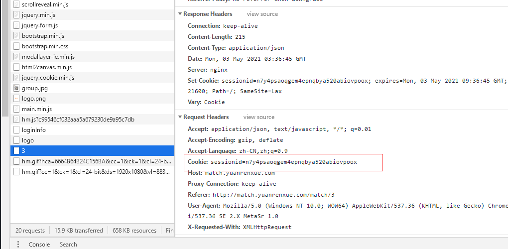
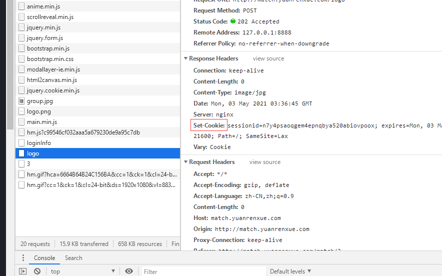

# 一.分析
通过抓包显示，并没有加密的参数。那么直接模拟即可.
请求接口返回了一段加密的js，于是将js解密，观看逻辑，，，，，这段js啥用也没有啊！！！！
回顾初心:我们想要的是接口返回的数据那么我们要看接口，接口没有加密，只有请求的cookies变化
假设就是这段js进行了cookie的操作，但是通过观察cookie,并不是这段js来源的，摆明了就是来骗来偷袭
经过如下论证
 上述的图片为请求api接口的cookies
而它的来源

也就是说请求这个api接口之前获得这个sessionid就可以访问这个api接口了。

直接复制请求搞起,还是请求失败，忘了加请求头了，加上请求头继续搞起，还是失败，对比了一下浏览器访问的url,没有什么区别，
于是怀疑自己，经过fiddler重发发现我复制的请求头和fidder发送的请求头顺序并不相同,复制fidder的请求头放进去可以顺利拿到数据

经过本题:我们知道的是我们要获得什么东西从而去寻找获得这个东西的先驱条件，切莫中途误入歧途，请求头顺序也要注意一下 突然让我想起python请求的指纹问题 哈哈这个题弄完就去弄指纹。

